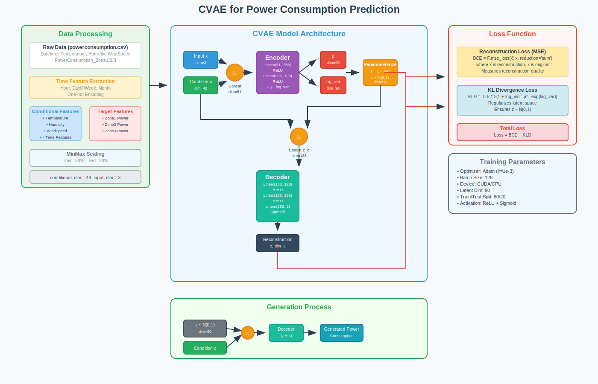
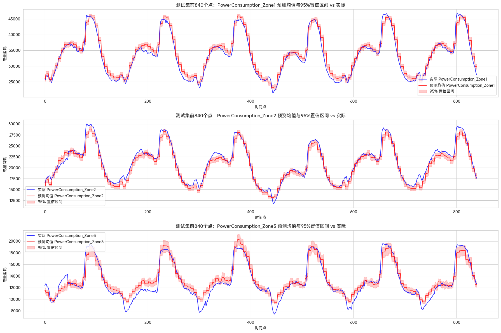
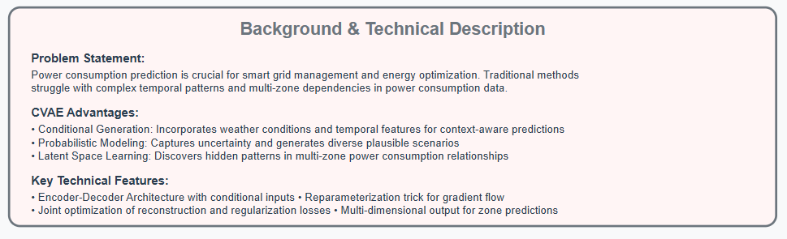
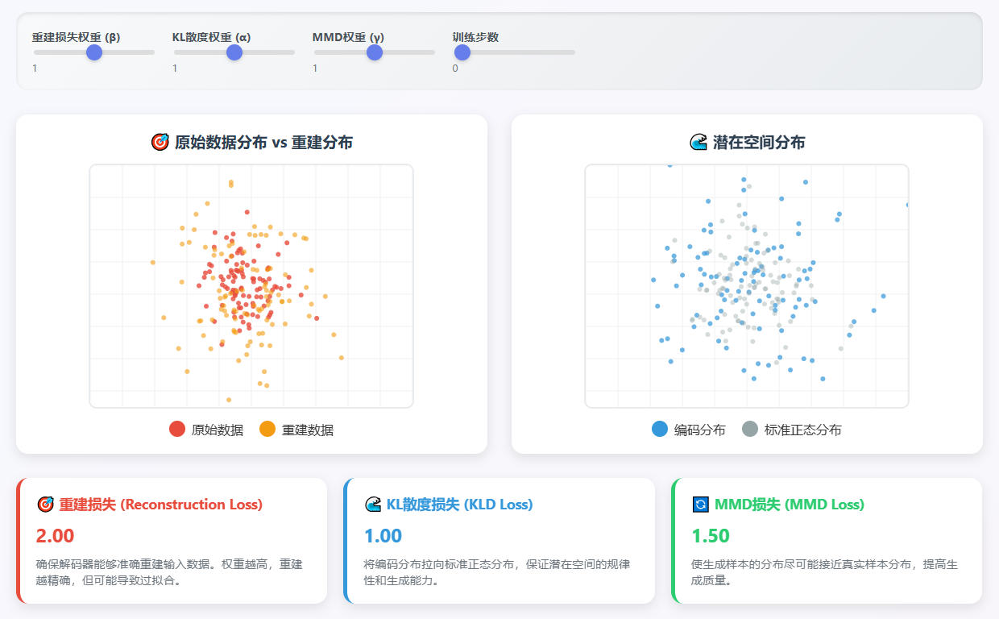
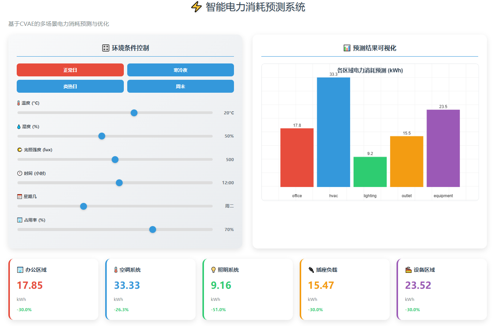

# EnergyGen-CVAE

**Conditional Variational Autoencoder for Synthetic Power Load Generation Based on Environmental Features**

[](https://www.python.org/)[](LICENSE)[]()

---

## 🔍 Overview

`EnergyGen-CVAE` is a lightweight and extensible generative framework for synthesizing realistic power consumption data, conditioned on external environmental factors such as temperature, humidity, wind speed, and solar radiation. This project leverages the **Conditional Variational Autoencoder (CVAE)** to model uncertainty and generate diverse yet physically-plausible time-series samples, supporting downstream applications in **forecasting**, **scenario simulation**, and **data augmentation**.

This work is inspired by real-world challenges in smart grid load simulation, where labeled power consumption data is often limited, noisy, or costly to collect.





---

## 📌 Key Features

- ✅ **Multi-zone modeling**: Simultaneously generate consumption data for multiple power zones (Zone1, Zone2, Zone3).
- 📊 **Uncertainty visualization**: Output confidence intervals for generated time series.
- ⚡ **Condition-aware generation**: Capture dynamic influence of temperature, humidity, wind, and irradiance.
- 🧠 **Scalable CVAE structure**: Easily replace encoder/decoder architectures.
- 🔁 **Data augmentation ready**: Useful for enriching load prediction datasets.




---

## 🧠 Methodology

We implement a CVAE where the conditional input $x \in \mathbb{R}^d$ includes external weather features and the target $y \in \mathbb{R}^k$ is the actual consumption vector.

### Key techniques:

* KL annealing
* MSE + reconstruction loss
* Per-zone decoder output
* Random z sampling for diverse generation

### Loss function:



---

## 📈 Evaluation

We compare model performance using:

* RMSE / KLD / MMD between generated and actual data
* Coverage & width of confidence intervals
* Visual fidelity across zones and time spans

Visualization:

This visualization demonstrates the predictive capability of our CVAE-based energy consumption model. Given a set of environmental inputs — temperature, humidity, lighting intensity, time, weekday, and occupancy rate — the model generates energy usage forecasts across multiple building zones.

What’s significant is the model’s **ability to generalize beyond the training distribution**. By inputting modified or unseen contextual variables (such as slightly shifted `cons` patterns or new time slots), the system extrapolates plausible power consumption across zones, enabling simulation in out-of-distribution (OOD) scenarios and fine-grained energy control optimization.



---

### 🧪 Example Usage

```python
example_input = {
    "Temperature": 9.0,
    "Humidity": 86.7,
    "WindSpeed": 0.08,
    "GeneralDiffuseFlows": 117.2,
    "DiffuseFlows": 30.43,
    "Hour": 9,
    "DayOfWeek": 0,
    "Month": 1
}

generated = generate_power_consumption(example_input)
for zone, value in generated.items():
    print(f"{zone}: {value:.2f} kWh")

```

---

## 💼 Applications

* 🔌 Smart grid load simulation
* 🧪 Synthetic scenario testing
* 📉 Data-driven forecasting model pretraining
* 📊 Enhancing robustness of anomaly detection models

---

## 🤝 Acknowledgements

This work was initially developed as part of a time-series modeling research module. The structure draws inspiration from academic works on CVAE and real-world energy modeling.

---

## 📄 License

This project is released under the MIT License.

## ⭐️ Note
If you find this project helpful, please ⭐️ star the repo or cite our work!
