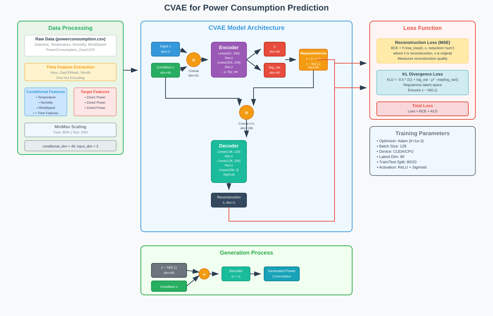
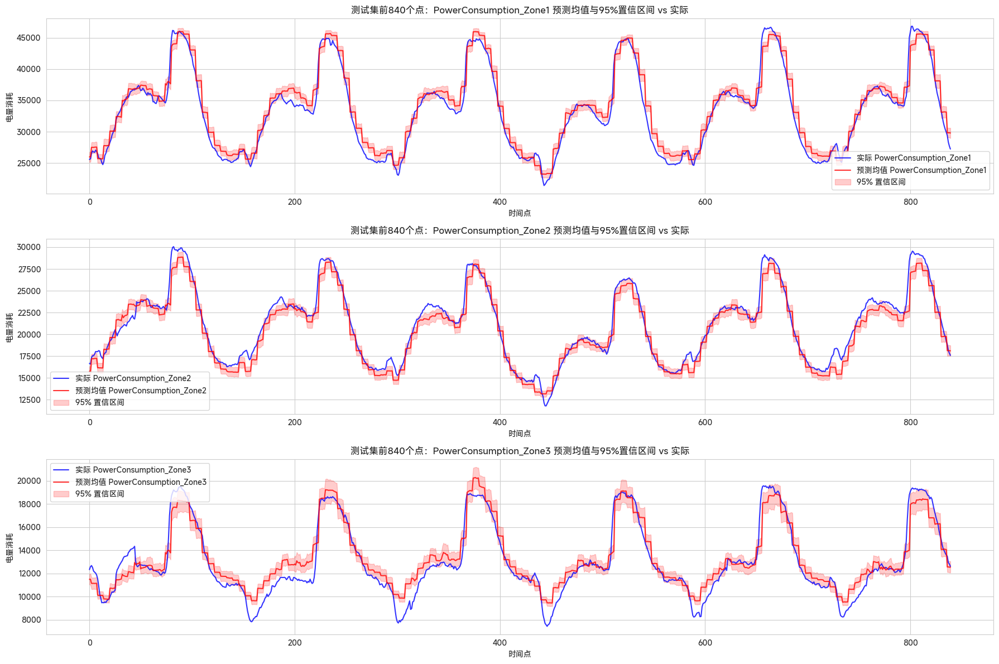
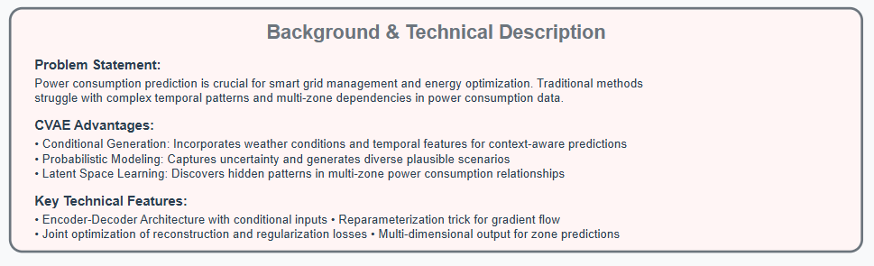
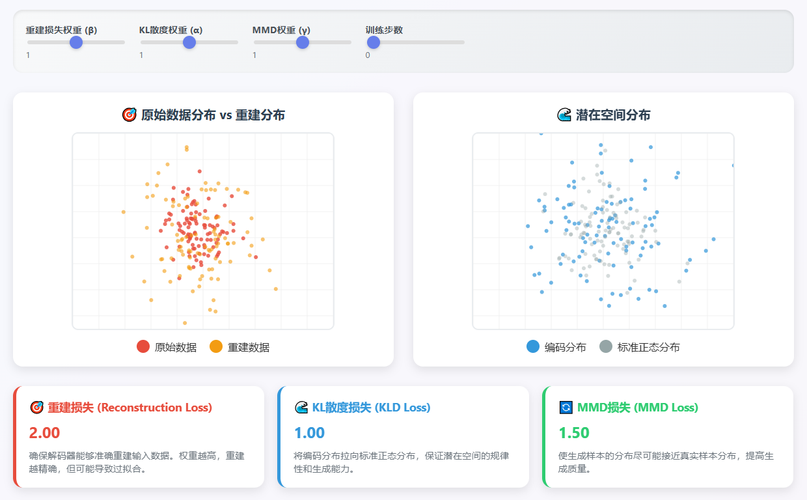
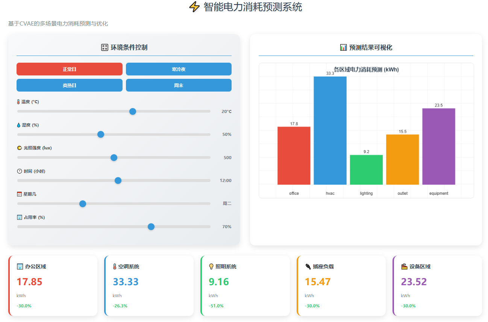

# EnergyGen-CVAE

**Conditional Variational Autoencoder for Synthetic Power Load Generation Based on Environmental Features**

[](https://www.python.org/)[](LICENSE)[]()

---

## 🔍 Overview

`EnergyGen-CVAE` is a lightweight and extensible generative framework for synthesizing realistic power consumption data, conditioned on external environmental factors such as temperature, humidity, wind speed, and solar radiation. This project leverages the **Conditional Variational Autoencoder (CVAE)** to model uncertainty and generate diverse yet physically-plausible time-series samples, supporting downstream applications in **forecasting**, **scenario simulation**, and **data augmentation**.

This work is inspired by real-world challenges in smart grid load simulation, where labeled power consumption data is often limited, noisy, or costly to collect.





------

### 📊 Dataset Description

We use a structured time-series dataset consisting of **environmental regressors** and **zone-wise electricity consumption targets**. Each row corresponds to a 10-minute interval sample describing both external environmental conditions and internal energy usage across multiple zones.

#### ➤ Input Features (Regressors):

| Feature Name          | Description                     | Unit |
| --------------------- | ------------------------------- | ---- |
| `Temperature`         | Outdoor temperature             | °C   |
| `Humidity`            | Relative humidity               | %    |
| `WindSpeed`           | Wind speed                      | m/s  |
| `GeneralDiffuseFlows` | Global diffuse solar irradiance | W/m² |
| `DiffuseFlows`        | Diffuse irradiance              | W/m² |

These regressors serve as the **conditioning inputs** to the CVAE model, enabling the generation of energy consumption patterns under different weather and solar scenarios.

------

#### 🎯 Target Variables (Outputs):

| Target Name              | Description                               | Unit |
| ------------------------ | ----------------------------------------- | ---- |
| `PowerConsumption_Zone1` | Power usage in Zone 1 (e.g., office area) | kWh  |
| `PowerConsumption_Zone2` | Power usage in Zone 2 (e.g., HVAC system) | kWh  |
| `PowerConsumption_Zone3` | Power usage in Zone 3 (e.g., lighting)    | kWh  |
| `TotalLoad`              | Aggregated consumption across all zones   | kWh  |

The **model aims to learn the conditional distribution** of these target values given the environmental inputs, and to generate realistic, uncertainty-aware consumption predictions.

### 

| Feature Name | Description                     |
| ------------ | ------------------------------- |
| `Hour`       | Hour of day (0–23)              |
| `DayOfWeek`  | Day of week (0=Sun, ..., 6=Sat) |
| `Month`      | Month index (1–12)              |

### 🔥Performance

#### **Zone 1 **

| Metric (Zone 1)   | CVAE      | FlowCVAE  | XGBoost  | Lasso         | CatBoost      |
| ----------------- | --------- | --------- | -------- | ------------- | ------------- |
| **MSE ↓**         | 24.81M    | 🥈 20.67M  | 🥉 22.03M | 25.06M        | 🥇 **17.78M**  |
| **MAE ↓**         | 4232.08   | 🥈 4077.58 | 4359.69  | 🥉 4099.51     | 🥇 **3876.69** |
| **MAPE ↓**        | 🥉 14.79%  | 🥈 14.78%  | 15.48%   | 15.34%        | 🥇 **13.89%**  |
| **SMAPE ↓**       | 🥉 13.47%  | 🥈 13.49%  | 14.19%   | 13.76%        | 🥇 **12.81%**  |
| **R² ↑**          | 🥉 0.347   | 🥈 0.456   | 🥉 0.421  | 0.341         | 🥇 **0.532**   |
| **Wasserstein ↓** | 🥉 3861.46 | 3957.32   | 4260.60  | 🥇 **3600.27** | 🥈 3748.62     |
| **KS ↓**          | 🥈 0.274   | 0.287     | 0.300    | 🥇 **0.258**   | 🥉 0.302       |
| **Skew_Diff ↓**   | 0.191     | 0.227     | 🥈 0.056  | 0.358         | 🥇 **0.055**   |


#### **Zone 2 **

| Metric (Zone 2)   | CVAE        | FlowCVAE      | XGBoost   | Lasso   | CatBoost  |
| ----------------- | ----------- | ------------- | --------- | ------- | --------- |
| **MSE ↓**         | 15.21M      | 🥇 **8.46M**   | 🥈 10.17M  | 28.54M  | 🥉 11.50M  |
| **MAE ↓**         | 3070.13     | 🥇 **2248.50** | 🥈 2558.04 | 4311.42 | 🥉 2742.08 |
| **MAPE ↓**        | 12.82%      | 🥇 **9.02%**   | 🥈 10.23%  | 17.16%  | 🥉 10.87%  |
| **SMAPE ↓**       | 13.94%      | 🥇 **9.52%**   | 🥈 10.95%  | 19.26%  | 🥉 11.68%  |
| **R² ↑**          | 0.494       | 🥇 **0.719**   | 🥈 0.662   | 0.051   | 🥉 0.618   |
| **Wasserstein ↓** | 🥉 2462.87   | 🥇 **1774.97** | 🥈 2363.27 | 3955.35 | 2628.24   |
| **KS ↓**          | 🥇 **0.176** | 🥈 0.204       | 🥉 0.221   | 0.392   | 0.262     |
| **Skew_Diff ↓**   | 🥈 0.212     | 🥇 **0.106**   | 🥉 0.210   | 0.471   | 0.233     |


#### **Zone 3 **

| Metric (Zone 3)   | CVAE    | FlowCVAE      | XGBoost   | Lasso     | CatBoost    |
| ----------------- | ------- | ------------- | --------- | --------- | ----------- |
| **MSE ↓**         | 101.25M | 🥇 **3.90M**   | 🥉 5.73M   | 15.34M    | 🥈 5.26M     |
| **MAE ↓**         | 8148.69 | 🥇 **1418.38** | 🥉 2073.42 | 3187.49   | 🥈 2007.10   |
| **MAPE ↓**        | 73.35%  | 🥇 **11.18%**  | 🥉 18.43%  | 28.36%    | 🥈 17.98%    |
| **SMAPE ↓**       | 47.89%  | 🥇 **11.51%**  | 🥉 16.78%  | 34.35%    | 🥈 16.42%    |
| **R² ↑**          | -8.303  | 🥇 **0.642**   | 🥉 0.474   | -0.410    | 🥈 0.517     |
| **Wasserstein ↓** | 8025.68 | 🥇 **540.34**  | 🥉 1516.04 | 🥈 1482.44 | 1488.49     |
| **KS ↓**          | 0.550   | 🥇 **0.110**   | 🥉 0.369   | 🥈 0.228   | 0.347       |
| **Skew_Diff ↓**   | 🥈 0.065 | 0.380         | 🥉 0.091   | 0.749     | 🥇 **0.057** |

## 📌 Key Features

- ✅ **Multi-zone modeling**: Simultaneously generate consumption data for multiple power zones (Zone1, Zone2, Zone3).
- 📊 **Uncertainty visualization**: Output confidence intervals for generated time series.
- ⚡ **Condition-aware generation**: Capture dynamic influence of temperature, humidity, wind, and irradiance.
- 🧠 **Scalable CVAE structure**: Easily replace encoder/decoder architectures.
- 🔁 **Data augmentation ready**: Useful for enriching load prediction datasets.




---

## 🧠 Methodology

We implement a CVAE where the conditional input $x \in \mathbb{R}^d$ includes external weather features and the target $y \in \mathbb{R}^k$ is the actual consumption vector.

### Key techniques:

* KL annealing
* MSE + reconstruction loss
* Per-zone decoder output
* Random z sampling for diverse generation

### Loss function:



---

## 📈 Evaluation

We compare model performance using:

* RMSE / KLD / MMD between generated and actual data
* Coverage & width of confidence intervals
* Visual fidelity across zones and time spans

Visualization:

This visualization demonstrates the predictive capability of our CVAE-based energy consumption model. Given a set of environmental inputs — temperature, humidity, lighting intensity, time, weekday, and occupancy rate — the model generates energy usage forecasts across multiple building zones.

What’s significant is the model’s **ability to generalize beyond the training distribution**. By inputting modified or unseen contextual variables (such as slightly shifted `cons` patterns or new time slots), the system extrapolates plausible power consumption across zones, enabling simulation in out-of-distribution (OOD) scenarios and fine-grained energy control optimization.



---

### 🧪 Example Usage

```python
example_input = {
    "Temperature": 9.0,
    "Humidity": 86.7,
    "WindSpeed": 0.08,
    "GeneralDiffuseFlows": 117.2,
    "DiffuseFlows": 30.43,
    "Hour": 9,
    "DayOfWeek": 0,
    "Month": 1
}

generated = generate_power_consumption(example_input)
for zone, value in generated.items():
    print(f"{zone}: {value:.2f} kWh")

```


## 💼 Applications

* 🔌 Smart grid load simulation
* 🧪 Synthetic scenario testing
* 📉 Data-driven forecasting model pretraining
* 📊 Enhancing robustness of anomaly detection models


## 📚 Citation

If you find this project helpful in your research, please consider citing:

```latex
@misc{energygen_cvae_2025,
  title        = {EnergyGen-CVAE: Conditional Variational Autoencoder for Synthetic Power Load Generation},
  author       = {Yao Wu, Peng Yue},
  institution  = {Westlake University},
  year         = {2025},
  howpublished = {\url{https://github.com/Republic1024/EnergyGen-CVAE}},
  note         = {Available at GitHub}
}

```


## 📄 License

This project is released under the MIT License.


## ⭐️ Note

If you find this project helpful, please ⭐️ star the repo or cite our work!
